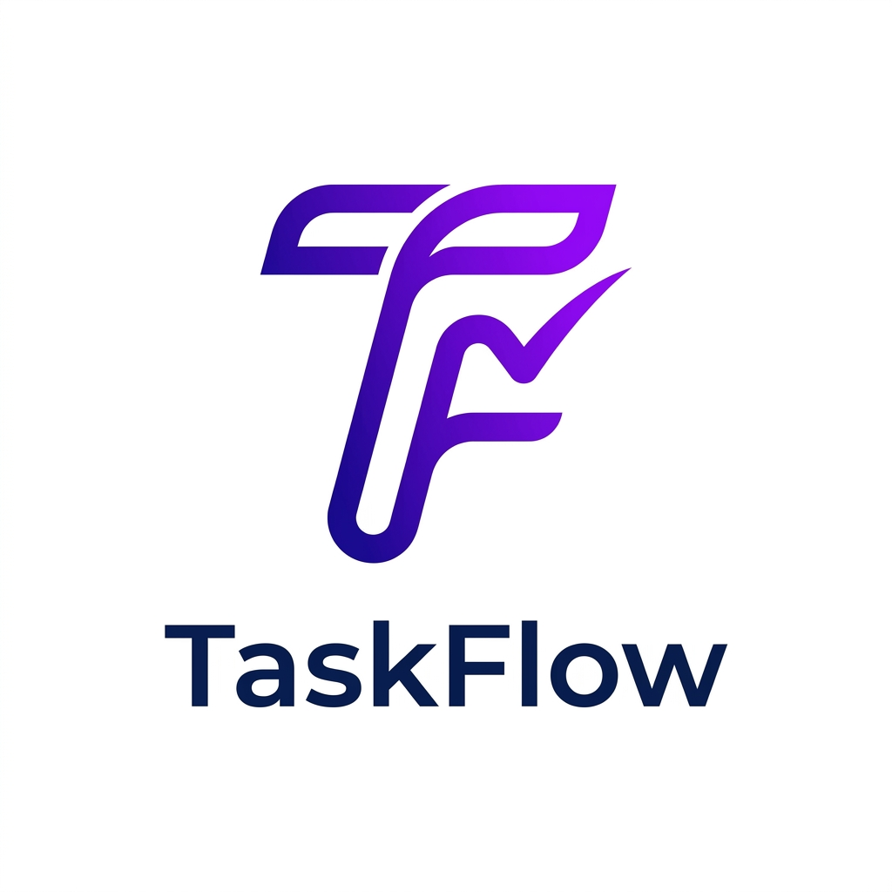

# TaskFlow — Team Task Manager

TaskFlow is a premium, full-stack task management application designed for teams to collaborate efficiently. Built with the MERN stack, it features a modern light-mode UI, role-based access control, and real-time dashboard analytics.

## Features

- **Dynamic Dashboard:** High-contrast visualization of task statuses, project counts, and overdue items.
- **Role-Based Access (RBAC):** Separate interfaces and permissions for Admins and Members.
- **Project Management:** Create projects, set priorities, and assign dedicated team members.
- **Kanban & List Views:** Manage tasks using a flexible Kanban board or a detailed list view.
- **Secure Backend:** JWT Authentication, Rate Limiting, Helmet security headers, and NoSQL injection protection.
- **Responsive Design:** Fully optimized for mobile, tablet, and desktop screens.




##  Tech Stack

- **Frontend:** React.js, Vite, Lucide Icons, Vanilla CSS
- **Backend:** Node.js, Express.js
- **Database:** MongoDB (Mongoose)
- **Security:** JWT, Bcrypt, Helmet, Express Rate Limit

## Getting Started

### 1. Clone the repository
```bash
git clone <repository-url>
cd Task-Manager
```

### 2. Install Dependencies
```bash
# Install root & backend dependencies
npm install

# Install frontend dependencies
cd client && npm install
cd ..
```

### 3. Environment Setup
Create a `.env` file in the root directory:
```env
PORT=5000
MONGO_URI=your_mongodb_uri
JWT_SECRET=your_secret_key
JWT_EXPIRE=7d
NODE_ENV=development
```

### 4. Run the Application
```bash
# Start both Backend and Frontend concurrently
npm run dev
```

##  Demo Credentials (Indian Context)

| Role | Email | Password | Name |
| :--- | :--- | :--- | :--- |
| **Admin** | `admin@taskmanager.com` | `admin123` | Arjun Sharma |
| **Member** | `priya@taskmanager.com` | `member123` | Priya Patel |
| **Member** | `rahul@taskmanager.com` | `member123` | Rahul Verma |

##  Security Measures
- **Helmet:** Secure HTTP headers.
- **Rate Limit:** Prevents brute-force attacks.
- **Mongo Sanitize:** Prevents NoSQL Injection.
- **XSS Clean:** Protects against Cross-Site Scripting.

---
Developed with by Abhishek Yadav
